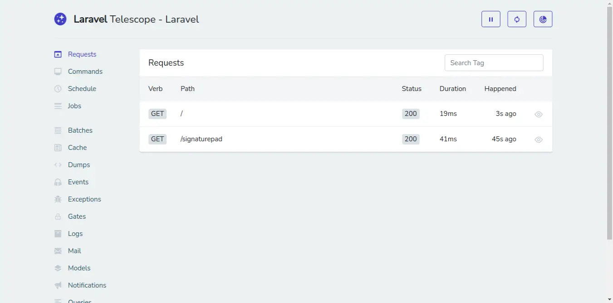

# Laravel-Telescope
Laravel Telescope is a debug assistant for Laravel. Whenever you write code it is very hard to debug the error in your application manually. Telescope provides access to the requests coming into your application, exceptions, log entries, database queries, model watch, catch, redis, queued jobs, mail, scheduled tasks and more in one place.



```bash
git clone https://github.com/ruhulamin63/Laravel-Telescope.git
```

```bash
cp .env.example .env
```

```bash
DB_CONNECTION=mysql
DB_HOST=127.0.0.1
DB_PORT=3306
DB_DATABASE=your-db-name
DB_USERNAME=root
DB_PASSWORD=
```

```bash
composer update
```

```bash
php artisan migrate
```

### Public Access Route
```bash
localhost:8000/telescope/requests
```

#### Install Laravel Telescope Package
Install telescope for with following command:
```bash
composer require laravel/telescope
```

you can also install for specific environment:
```bash
composer require laravel/telescope --dev
```

### Install Telescope
after install package, we have to install telescope by using following command that will create migration files and configuration file.

```bash
php artisan telescope:install
```

now let's run following command to create tables for telescope.
```bash
php artisan migrate
```